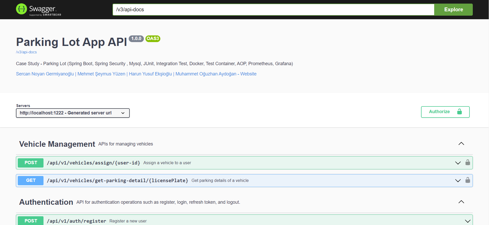

# Case Study - Parking Lot

<p align="center">
    
</p>

### 📖 Information

<ul style="list-style-type:disc">
  <li><b>Parking Lot</b> is a <b>Spring Boot application</b> covering important and useful features related to managing parking areas, park check-ins and check-outs for drivers, user management, and vehicle management.</li> 
  <li>
    <b>Roles:</b>
    <ul>
      <li><b>Admin:</b> Users with administrative privileges.</li>
      <li><b>Driver:</b> Users with driver privileges.</li>
    </ul>
    <b>Explanation:</b>
    <ul>
      <li><b>AuthController:</b> API for authentication operations such as register, login, refresh token, and logout.</li>
      <li><b>ParkController:</b> APIs related to park check-ins and check-outs for <b>drivers</b>.</li>
      <li><b>ParkingAreaController:</b> APIs for managing parking areas, including creating, updating, and deleting parking areas, as well as retrieving parking area information and daily income handled with <b>admins</b></li>
      <li><b>UserController:</b> APIs for managing user information, including retrieving user information by ID for both <b>admins</b> and <b>drivers</b>.</li>
      <li><b>VehicleController:</b> APIs for managing vehicles, including assigning a vehicle to a user and retrieving parking details of a vehicle handled with <b>drivers</b>.</li>
    </ul>
  </li>
</ul>

### Explore Rest APIs

<table style="width:100%">
  <tr>
      <th>Method</th>
      <th>Url</th>
      <th>Description</th>
      <th>Request Body</th>
      <th>Header</th>
      <th>Valid Path Variable</th>
      <th>Request Param</th>
      <th>No Path Variable</th>
  </tr>
  <tr>
      <td>POST</td>
      <td>/register</td>
      <td>Register a new user (Admin and Driver)</td>
      <td>SignupRequest request</td>
      <td></td>
      <td></td>
      <td></td>
      <td></td>
  </tr>
  <tr>
      <td>POST</td>
      <td>/login</td>
      <td>Login user (Admin and Driver)</td>
      <td>LoginRequest request</td>
      <td></td>
      <td></td>
      <td></td>
      <td></td>
  </tr>
  <tr>
      <td>POST</td>
      <td>/refreshtoken</td>
      <td>Refresh token (Admin and Driver)</td>
      <td>TokenRefreshRequest request</td>
      <td></td>
      <td></td>
      <td></td>
      <td></td>
  </tr>
  <tr>
    <td>POST</td>
    <td>/logout</td>
    <td>Logout user (Admin and Driver)</td>
    <td></td>
    <td>Authorization header with Bearer token</td>
    <td></td>
    <td></td>
    <td></td>
  </tr>
  <tr>
    <td>POST</td>
    <td>/parks/userId/{userId}/check-in</td>
    <td>Check in to a park (Driver)</td>
    <td>ParkCheckInRequest request</td>
    <td>Authorization header with Bearer token</td>
    <td>{userId} - Valid UUID</td>
    <td></td>
    <td></td>
  </tr>
  <tr>
    <td>POST</td>
    <td>/parks/userId/{userId}/check-out</td>
    <td>Check out from a park (Driver)</td>
    <td>ParkCheckOutRequest request</td>
    <td>Authorization header with Bearer token</td>
    <td>{userId} - Valid UUID</td>
    <td></td>
    <td></td>
  </tr>
  <tr>
    <td>POST</td>
    <td>/parking-area</td>
    <td>Create a new parking area (Admin)</td>
    <td>ParkingAreaCreateRequest request</td>
    <td>Authorization header with Bearer token</td>
    <td></td>
    <td></td>
    <td></td>
  </tr>
  <tr>
    <td>GET</td>
    <td>/parking-area/id/{parkingAreaId}</td>
    <td>Get a parking area by ID (Admin)</td>
    <td></td>
    <td>Authorization header with Bearer token</td>
    <td>{parkingAreaId} - Valid UUID</td>
    <td></td>
    <td></td>
  </tr>
  <tr>
    <td>GET</td>
    <td>/parking-area/name/{name}</td>
    <td>Get a parking area by name (Admin)</td>
    <td></td>
    <td>Authorization header with Bearer token</td>
    <td>{name} - Non-empty string</td>
    <td></td>
    <td></td>
  </tr>
  <tr>
    <td>GET</td>
    <td>/parking-area/income</td>
    <td>Get daily income for a parking area (Admin)</td>
    <td>date - Date in dd-MM-yyyy format<br>parkingAreaId - String</td>
    <td>Authorization header with Bearer token</td>
    <td></td>
    <td>parkingAreaId - Valid UUID , date - Valid Date</td>
    <td></td>
  </tr>
  <tr>
    <td>DELETE</td>
    <td>/parking-area/{parkingAreaId}</td>
    <td>Delete a parking area by ID (Admin)</td>
    <td></td>
    <td>Authorization header with Bearer token</td>
    <td>{parkingAreaId} - Valid UUID</td>
    <td></td>
    <td></td>
  </tr>
  <tr>
    <td>PUT</td>
    <td>/parking-area/{parkingAreaId}</td>
    <td>Update a parking area by ID (Admin)</td>
    <td>ParkingAreaUpdateRequest request</td>
    <td>Authorization header with Bearer token</td>
    <td>{parkingAreaId} - Valid UUID</td>
    <td></td>
    <td></td>
  </tr>
  <tr>
    <td>GET</td>
    <td>/users/user/{user-id}</td>
    <td>Get user information by ID (Driver)</td>
    <td></td>
    <td>Authorization header with Bearer token</td>
    <td>{user-id} - Valid UUID</td>
    <td></td>
    <td></td>
  </tr>
  <tr>
    <td>GET</td>
    <td>/users/admin/{admin-id}</td>
    <td>Get admin information by ID (Admin)</td>
    <td></td>
    <td>Authorization header with Bearer token</td>
    <td>{admin-id} - Valid UUID</td>
    <td></td>
    <td></td>
  </tr>
  <tr>
    <td>POST</td>
    <td>/vehicles/assign/{user-id}</td>
    <td>Assign a vehicle to a user (Driver)</td>
    <td>VehicleRequest request</td>
    <td>Authorization header with Bearer token</td>
    <td>{user-id} - Valid UUID</td>
    <td></td>
    <td></td>
  </tr>
  <tr>
    <td>GET</td>
    <td>/vehicles/get-parking-detail/{licensePlate}</td>
    <td>Get parking details of a vehicle (Driver)</td>
    <td></td>
    <td>Authorization header with Bearer token</td>
    <td>{licensePlate} - String</td>
    <td></td>
    <td></td>
  </tr>
</table>


### Technologies

---
- Java 17
- Spring Boot 3.0
- Spring Security
- JWT
- Restful API
- Lombok
- Maven
- Junit5
- Mockito
- Integration Tests
- Docker
- Docker Compose
- CI/CD (Github Actions)
- Prometheus and Grafana
- Postman
- Actuator
- Open Api (Swagger 3)
- Liquibase

### Postman

```
Import postman collection under postman_collection folder
```

### Open Api (Swagger 3)

```
http://localhost:1222/swagger-ui/index.html
```

### Prerequisites

#### Define Variable in .env file

```
DATABASE_USERNAME={DATABASE_USERNAME}
DATABASE_PASSWORD={DATABASE_PASSWORD}
PARKING_LOT_LIQUIBASE_ENABLE_DROP_FIRST=true
```

---
- Maven or Docker
---


### Docker Run
The application can be built and run by the `Docker` engine. The `Dockerfile` has multistage build, so you do not need to build and run separately.

Please follow directions shown below in order to build and run the application with Docker Compose file;

```sh
$ cd parkinglot
$ docker-compose up -d
```

If you change anything in the project and run it on Docker, you can also use this command shown below

```sh
$ cd parkinglot
$ docker-compose up --build
```

---
### Maven Run
To build and run the application with `Maven`, please follow the directions shown below;

```sh
$ cd parkinglot
$ mvn clean install
$ mvn spring-boot:run
```

### Screenshots

<details>
<summary>Click here to show the screenshots of project</summary>
    <p> Figure 1 </p>
    
</details>

### Contributors

- [Sercan Noyan Germiyanoğlu](https://github.com/Rapter1990)
- [Muhammet Oğuzhan Aydoğdu](https://github.com/moaydogdu)
- [Mehmet Şeymus Yüzen](https://github.com/mehmetseymusyuzen)
- [Harun Yusuf Ekşioğlu](https://github.com/artfulCoder98)
